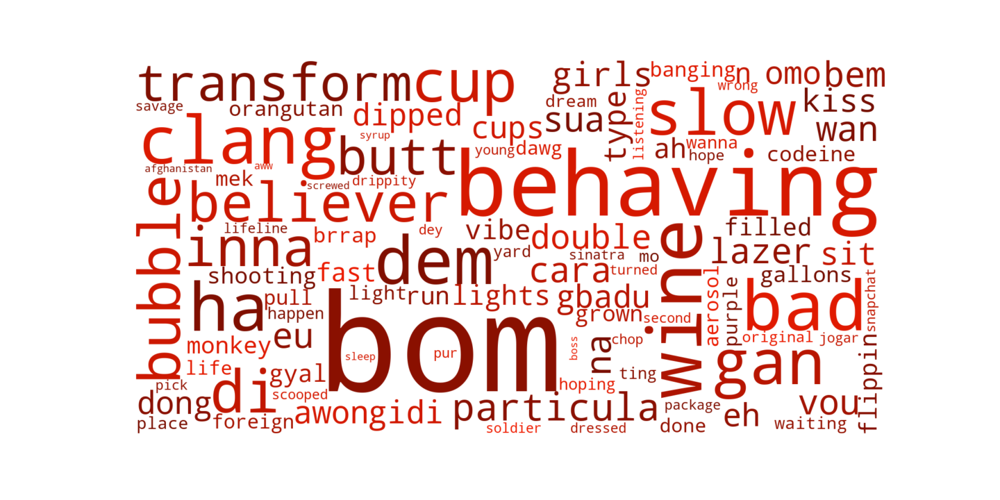
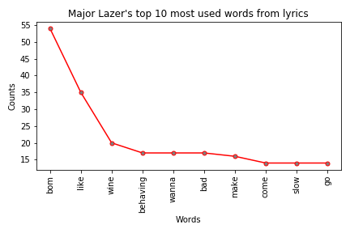
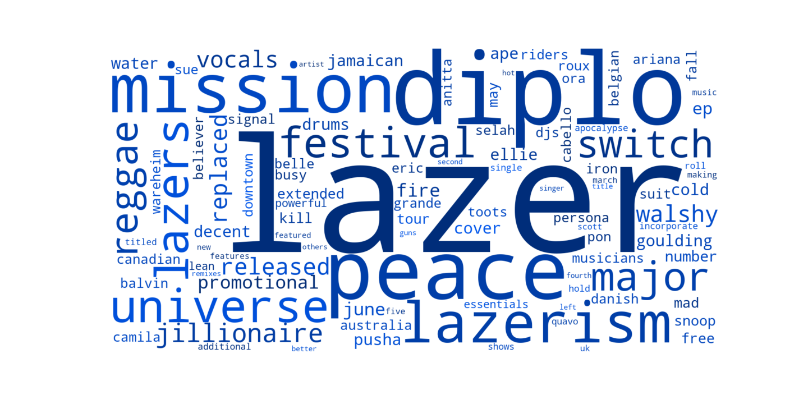

## Collaboration between artists in a organic network
### 02805 - Social Graphs and Interactions
https://guides.github.com/features/mastering-markdown/

### Introduction
Have you ever wondered about all the connected artists on Spotify featuring each other and how they might be connected? Have you ever listened to new music thinking "oh featuring that artist... AGAIN?" You are not alone with that feeling then. We have decided to check it out. So we dug into the Spotify API and found the top connected artists. We dug further into their songs to see if there were a specific way of using the words for these connected artists. And we dug even further and looked to Wikipedia to clear up if there were any similarities between those featuring artists. What we could see from the top artists ie. the ones that most often had a featuring artist with them was mostly the language. It was not for the fainthearted to read. 

### Data and API
Information about the data, format, size etc.

- Spotify API (artist and song details)
- Genius API (lyrics)
- Wikipedia API (description on artists)

Download a dataset if you want to play around with the data yourself.

For the full repository

<!-- Place this tag where you want the button to render. -->
<a class="github-button" href="https://github.com/marialyck/SocialGraphs/archive/master.zip" data-color-scheme="no-preference: light; light: light; dark: dark;" data-icon="octicon-cloud-download" data-size="large" aria-label="Download marialyck/SocialGraphs on GitHub">Download</a>

<a href="https://minhaskamal.github.io/DownGit/#/home?url=https://github.com/marialyck/SocialGraphs/tree/master/spotify">Download only the Spotify network</a> 

<a href="https://minhaskamal.github.io/DownGit/#/home?url=https://github.com/marialyck/SocialGraphs/tree/master/Dataset">Download only lyrics</a>

### Network: _how is it made?_

The following network is made upon a organic structure.

_Fig 2.2: Network graph_

For more details see [GitHub Flavored Markdown](https://guides.github.com/features/mastering-markdown/).

### Network: Analysis
Which analysis has been used?

### Audio Analysis
Some text here.

### Text Analysis
The text analysis contains information from lyrics and Wikipedia page on artits. The course of action is that the 5 choosen artist from the network is then being used to collect 5 songs from each artist. These songs words will then be analyzed to see if the artist are using the same words and which words are more specific to one artist.

#### Cleaning the text for further analysis
The first step in order to analyze text in this case both lyrics and text from Wikipedia, the text files must be "cleaned" to get the best result further on. By cleaning the purpose is to remove, punctuations (!?:;., etc.) this includes do not helps us, so those signs are removed. All words are being transformed into lower case, this helps to not being confused if the same word are written with full lower case or just the first letter is capital, this mistake are being avoided by simple removing the all capital letters and replacing them with lower case. Also stopwords are removed in order to focus on the specific words used by the artist or about the artist. Stopwords includes I, all, we, where and so on. The lyrics which are merged into one text file per artist contains square brackets just before a verse, to indicate which verse and who is performining that verse. This data is also removed. 

#### Starting to analyze the text
The initial plan is to see which words are mostly being used by an artist. This can be described as if all five artist repeatly singing a word, this word are not that interesting for us, therefor we perform what is called TF-IFD. This is term frequency–inverse document frequency, which describes first how important a word is in porpotion to the overall corpsus'. Then we calculate how offen this word is in a document or corpus in propotion to how many corpus there are in total. If a word appears in all corpurs', the lower the word will score. 

When the TF-IDF is calculated the result can then be used to create a visual representation of the words which just have been calculated. To illustrate this a wordcloud is a truly great option. The wordcloud features to show a given amount of words, these words' size depends on the result from previous calculation. To the larger the word is, the greater the value is. 

In this project, TF-IDF and wordclouds has been used to show which words are being writing into the respective artist lyrics. 

The first artist is Major Lazer. 

#### Major Lazer 
The first wordcloud is based on analysis from the groups lyrics (5 songs).

_Fig x.x: Wordcloud of 5 songs words from artits Major Lazer._

The words which are represented with the biggest font size, would be _behaving, kiss, wine and clang_. 
An interesting comparison is to compare the words from the wordcloud with the top 10 words being used in the 5 choosen songs. 

_Fig x.x: Top 10 most used words from artits Major Lazer's 5 choosen songs._

First, it seems to match, that the words from the wordclouds are similiar to the graph illustrating word count. This might result in that, these words are more likely to be used by Major Lazer than any of the 4 other artist.

Next one interesting analysis was to see if there are any similiarity between the artists lyrics and what people are writing about them on Wikipedia. In order to do this, the same process of cleaning the data has been made. After cleaning the data TF-IDF could be calculated to render a wordcloud based on data from Wikipedia. 

_Fig x.x: Wordcloud of information from artits Major Lazer's Wikipedia page._

### Conclusion
Sum up what the overall conclusion is, based on the questions we made.

